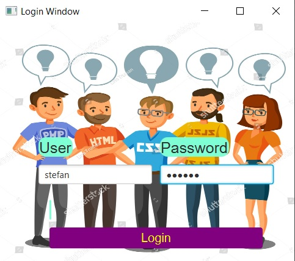
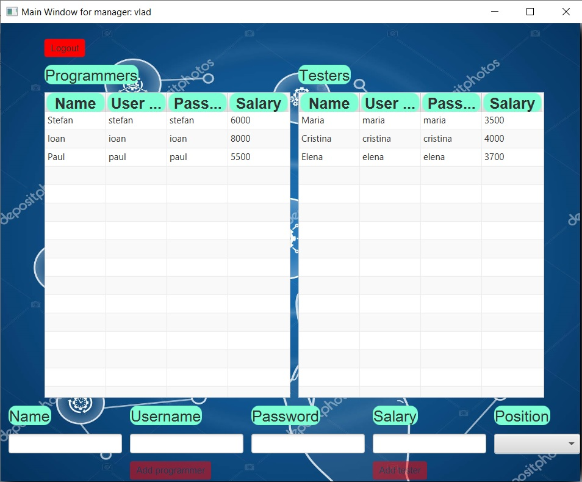
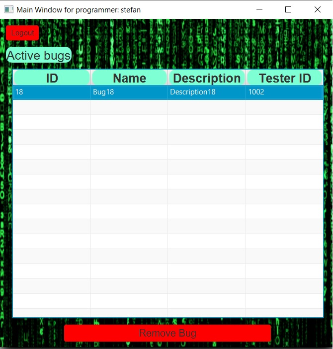
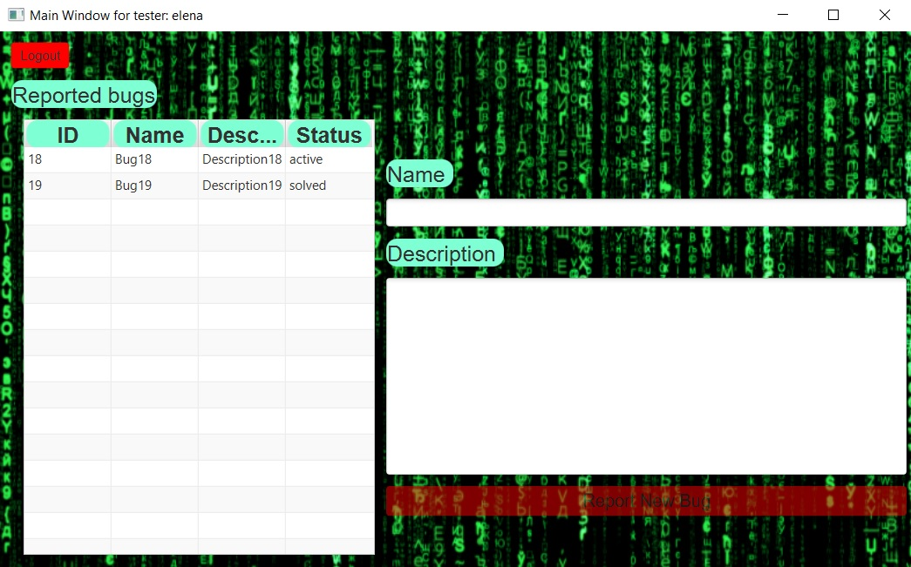

# Bug Report App

## Overview
The purpose of this application is to aid the communication between programmers and testers within a software company. Thus, a tester can report a bug that every programmer can see. A programmer can select a bug from the list and remove it. There is also a manager that can add new employees in the database. All users have credentials that must be used for logging in the application.

## Technical specifications
>**Frameworks**
```
This application was developed entirely in Java with the help of the following frameworks: 
1. Spring for dependency injection
2. Hibernate for Object Relational Mapping from an SQLite database.
```
>**Graphical user interface**
```
The graphical user interface was developed in javafx and the stylings were made in css.
```
>**Design patterns**
```
The main design patterns used in this application are:
```
```
1. Client-Server
The communication between the client and the server takes place as following:
1.a. The client initiates a request to a proxy server
1.b. The proxy server sends (with the help of sockets) the request to the server
1.c. The server deals with the client requests with the help of worker threads.
1.d. A worker thread solves the request and sends back a response to the client.
1.e. The proxy server manages the response and notifies the client.
```
```
2. Model-View-Controller
```
```
3. Observer
The server is observed by all connected clients. 
The client notifications (e.g. a new bug was added) are sent concurrently via a thread pooling mechanism. 
```

## Screenshots

### Login window



```
The user must enter its credentials in order to log in the app.
When both username and password fields are filled, the login button activates.
If the entered credentials are invalid, an error message is displayed below the button.
```

### Manager window



```
The manager can see a table of programmers and a table of testers.
The manager can add new programmers and testers.
```

### Programmer window



```
The programmer can resolve bugs by selecting them and by pressing the corresponding button.
A solved bug will dissapear from the bug list of every programmer.
```

### Tester window



```
A tester can see only the bugs introduced by himself/herself.
By reporting a new bug, every programmer will see it.
```
